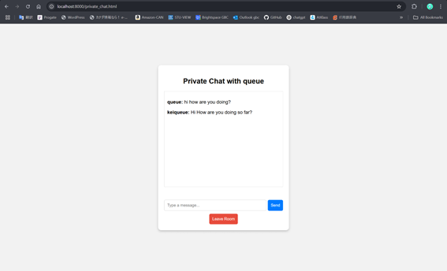

# COMP3133 LAB TEST 1 - CREATE CHAT APP

## 📝 Overview
This is a real-time chat application for **COMP3133 Lab Test 1**, developed by **Kei Ishikawa (ID: 101426567)**.  
The application supports **group chats**, **private messaging**, and **real-time updates** using **Socket.io** and **MongoDB** for message persistence.

---

## 📌 Features
- ✅ **User Authentication**
  - Signup & Login functionality with **MongoDB storage**
  - User sessions managed with `localStorage`
- ✅ **Group Chat**
  - Join pre-defined chat rooms (e.g., DevOps, Cloud Computing, Sports, Node.js)
  - Send and receive messages in real-time with **Socket.io**
  - Chat history is stored and retrieved from **MongoDB**
  - **Typing Indicator** for real-time feedback
- ✅ **Private Messaging**
  - Users can send direct messages to each other
  - Private chat history is stored in **MongoDB**
  - Real-time updates for private messages
  - Typing indicator for private chats
- ✅ **Leave Room & Logout**
  - Users can leave a group chat
  - Logout button clears session data

---

## 🛠️ Technologies Used
### **Frontend**
- **HTML5**, **CSS3**, **jQuery**, **Bootstrap**
- **Socket.io (Client-Side)** for real-time communication

### **Backend**
- **Node.js**, **Express.js**
- **MongoDB** with **Mongoose**
- **Socket.io (Server-Side)** for real-time chat functionality

---

## Output (Screenshots)

1. SignUp.html
This is a SignUp page. 
You can Add new Users from here. 


2. Login.html
This is a Login Page 


3. Index.html 
・This is Index page where you can select chatting types.


・Types of Chat Room


・Users for Private Chatting


4. Chat.html
This is a page where you can send messages in  group chat. 


5. Private_chat.html
This is a page where you can send private messages (1 to 1).


6. MongoDB Record
This is mongodb database records. 
・Group messages


・Private messages


・Users 


## 🚀 How to Run the Application
### **1️⃣ Clone the Repository**
```sh
git clone https://github.com/YOUR_GITHUB_USERNAME/101426567_lab_test1_chat_app.git
cd 101426567_lab_test1_chat_app
